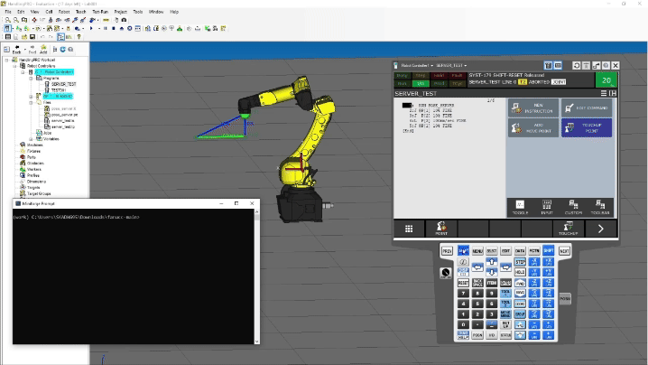

# fanuc-sm
Sample Python application for Socket Messaging with Fanuc

### Required Fanuc Options
- R632: Karel (Available by default in R-30iB Plus Controller)
- R648: User Socket Message
- R796: ASCII Program Loader (Optional) 

Check the availability of above options by going to **MENU** -> ```-- NEXT --``` -> ```STATUS``` -> ```VERSION ID``` -> <ins>```ORDER FI```</ins>

## ROBOGUIDE

### Setup

In this setup, Robot acts as Socket Server and Python Application as Client. Following are the steps to set up Socket Communication in ROBOGUIDE Teach Pendant:
1. Host Communication Setup: 
    - Network Setup
        - Go to **MENU** -> ```SETUP``` -> ```Host Comm``` -> **TCP/IP**
        - Since ROBOGUIDE Cell uses localhost IP address 127.0.0.1 by default; no need to modify these settings while working locally.

    - Server Tag Setup
        - Go to **MENU** -> ```SETUP``` -> ```Host Comm``` -> <ins>```[SHOW]```</ins> -> ```Servers``` -> **S8** -> <ins>```DETAIL```</ins>
        (Select the tag you want to set up for Socket Messaging, here tag 8 is selected)
        - Set ```Protocol``` -> <ins>```[CHOICE]```</ins> -> **SM**
        - Set ```Port``` -> PORT_NUM (Port Number to be used for Socket Messaging)
        - Set ```Startup State``` -> <ins>```[CHOICE]```</ins> -> **START**
        - Set <ins>```[ACTION]```</ins> -> **DEFINE**
        - Set <ins>```[ACTION]```</ins> -> **START**

2. System Variable Setup
    - Go to **MENU** -> ```Next``` -> ```SYSTEM``` -> ```Variables``` -> ```$HOSTS_CFG```
    - Go to the structure element corresponding to the tag selected previously, ```[8]``` in this case
    - Set ```$SERVER_PORT``` -> PORT_NUM (Port Number to be used for Socket Messaging)
    - If you want to communicate with UDP instead of TCP/IP, set ```$USE_UDP``` -> TRUE

For more information, refer to the section 10.3.2 of [Fanuc Ethernet Function Operator's Manual](https://drive.google.com/file/d/1mSqrSySawRiNfP9QWvAWjzDXuZ0T8baQ/view?usp=drive_link)

### Build
In ROBOGUIDE Window,
- Go to Project -> Add Files. Select and Open the .ls and .kl file from the Repo. The files can be found in the left pane at Workcell -> Robot Controllers -> Robot Controller1 -> Files
- Right click .kl file and Build the Karel Program
- Right click .ls file and Build the Robot Program

### Run
In ROBOGUIDE Teach Pendant, 
- Go to **SELECT** -> SERVER_TEST and Enter
- **SHIFT** + **FWD** to Start running the Program

In a Windows Terminal, run 
```console
python client.py
``` 
<p align="center">

</p>

## Real Robot

Coming Soon...

### References
[Fanuc Ethernet Function Operator's Manual](https://drive.google.com/file/d/1mSqrSySawRiNfP9QWvAWjzDXuZ0T8baQ/view?usp=drive_link)

[Fanuc Karel Reference Manual Rev H](https://drive.google.com/file/d/1dchHFF6haihQ2uItWrMn0E2FbHzAJBOG/view?usp=drive_link)
